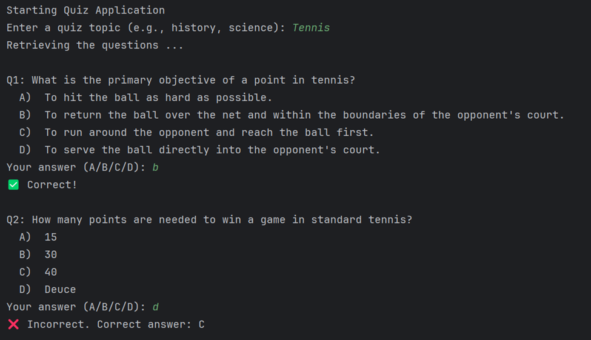
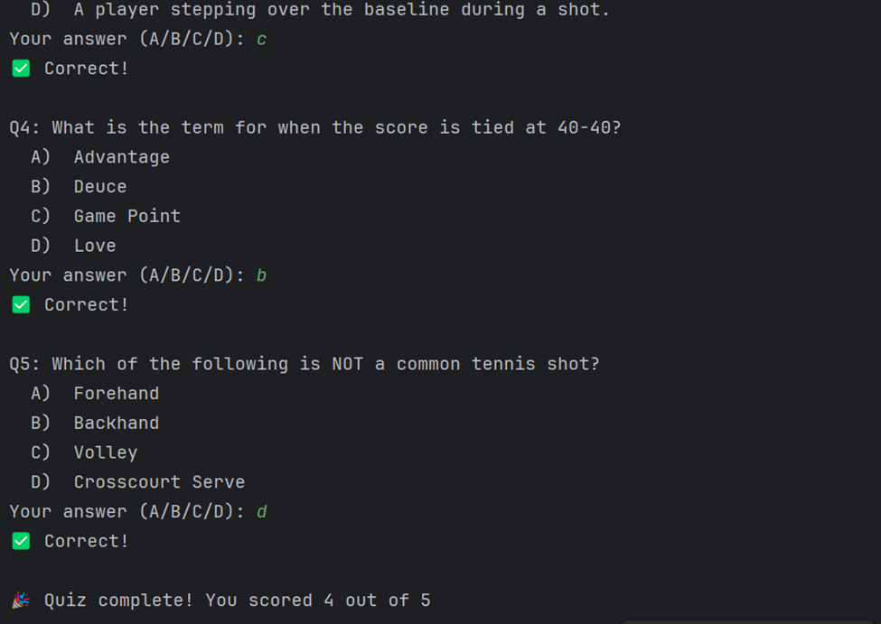

# READ ME

### Pre-requisite softwares

* Java 17
* Gradle
* Local Ollama

### Running Ollam locally

* Download and install the Ollam locally 
* Pull the required model using pull command. ('ollama pull gemma3:4b' )
* Start the modeul using 'ollam run gemma3:4b'

### Build

* ./gradlew clean build 

### Run the application

*  java -jar .\build\libs\quiz-0.0.1-SNAPSHOT.jar

